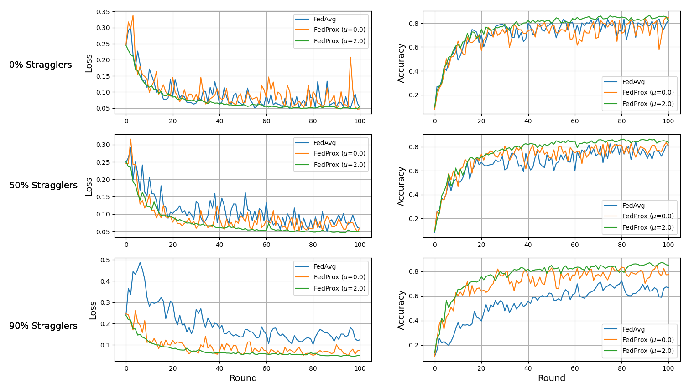

# FedProx MNIST

The following baseline replicates the experiments in *Federated Optimization in Heterogeneous Networks* (Li et al., 2018), which proposed the FedProx algorthim.

**Abstract:** Federated Learning is a distributed learning paradigm with two key challenges that differentiate it from traditional distributed optimization: (1) significant variability in terms of the systems characteristics on each device in the network (systems heterogeneity), and (2) non-identically distributed data across the network (statistical heterogeneity). In this work, we introduce a framework, FedProx, to tackle heterogeneity in federated networks. FedProx can be viewed as a generalization and re-parametrization of FedAvg, the current state-of-the-art method for federated learning. While this re-parameterization makes only minor modifications to the method itself, these modifications have important ramifications both in theory and in practice. Theoretically, we provide convergence guarantees for our framework when learning over data from non-identical distributions (statistical heterogeneity), and while adhering to device-level systems constraints by allowing each participating device to perform a variable amount of work (systems heterogeneity). Practically, we demonstrate that FedProx allows for more robust convergence than FedAvg across a suite of realistic federated datasets. In particular, in highly heterogeneous settings, FedProx demonstrates significantly more stable and accurate convergence behavior relative to FedAvg---improving absolute test accuracy by 22% on average.</i>

**Paper Authors:** 

Tian Li, Anit Kumar Sahu, Manzil Zaheer, Maziar Sanjabi, Ameet Talwalkar and Virginia Smith.

Note: If you use this implementation in your work, please remember to cite the original authors of the paper. 

**[Link to paper.](https://arxiv.org/abs/1812.06127)**

## Training Setup

### Models

This baseline contains two models:

* A logistic regression model used in the FedProx paper for MNIST (see `models/LogisticRegression`). This is the model used by default.
* A two-layer CNN network as used in the FedAvg paper (see `models/Net`)

### Training Paramaters

The following is a summary of the key hyperparameters most relevant for this baseline (FedProx+MNIST). These are the current defaults, but you can change them for your setting. For a complete list of hyperparameters and settings, please refer to `conf/config.yaml` (which runs FedProx) and `conf/fedavg.yaml` (which runs FedAvg dropping stragglers)

| Description | Value |
| ----------- | ----- |
| total clients | 1000 |
| clients per round | 10 |
| data partition | power law (2 classes per client) |
| optimizer | SGD with proximal term |
| proximal mu | 1.0 |
| stragglers_fraction | 0.9 |

## Running experiments

The `conf/config.yaml` file containing all the tunable hyperparameters and the necessary variables. [Hydra](https://hydra.cc/docs/tutorials/) is used to manage configs. The outputs of each experiment as well as a log is created automatically by Hydra. The output directory will follow the structure: `outputs/<date>/<time>`.

To run FedPox as:
```bash
python main.py # this will run using the default settings in the `conf/config.yaml`

# you can override settings dirctly from the command line
python main.py mu=1 num_rounds=200 # will set proximal mu to 1 and the number of rounds to 200
```

To run using FedAvg:
```bash
# this will use a variation of FedAvg that drops the clients that were flagged as stragglers
# This is done so to match the experimental setup in the FedProx paper
python main.py --config-name fedavg

# this config can also be overriden from the CLI
```

## Expected results

With the following command we run both FedProx and FedAvg configurations while iterating through different values of `mu` and `stragglers_fraction`. We ran each experiment five times (this is achieved by artifially adding an extra element to the config but that it doesn't have an impact on the FL setting `'+repeat_num=range(5)'`)

```bash
python main.py --multirun mu=0.0,2.0 stragglers_fraction=0.0,0.5,0.9 '+repeat_num=range(5)'
# note that for FedAvg we don't want to change the proximal term mu since it should be kept at 0.0
python main.py --config-name fedavg --multirun stragglers_fraction=0.0,0.5,0.9 '+repeat_num=range(5)'
```

The above commands would generate results that look like:

